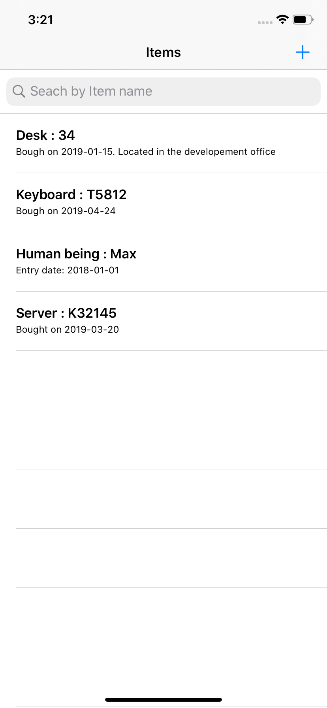
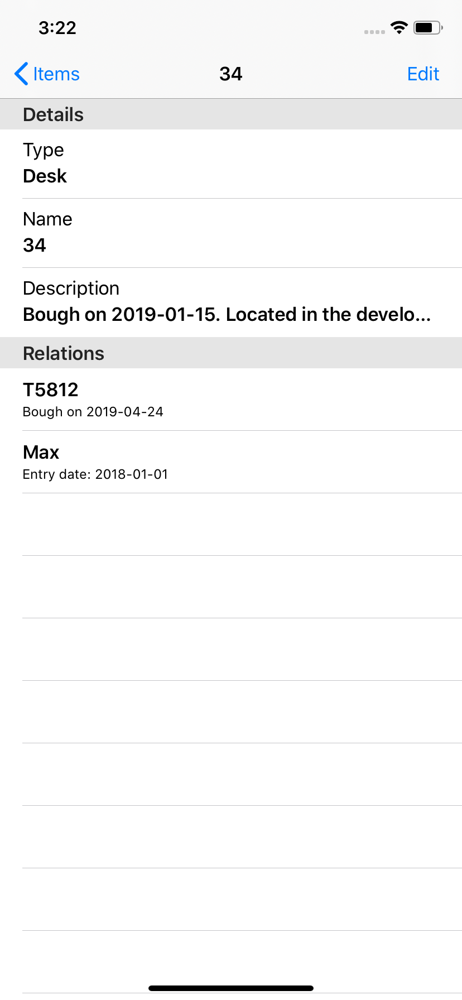
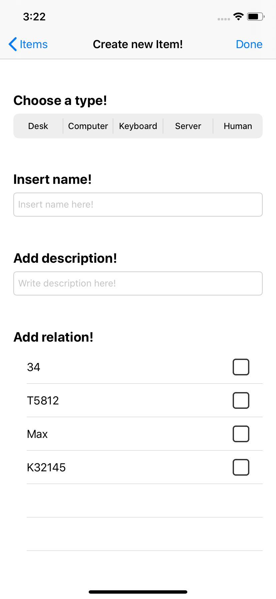
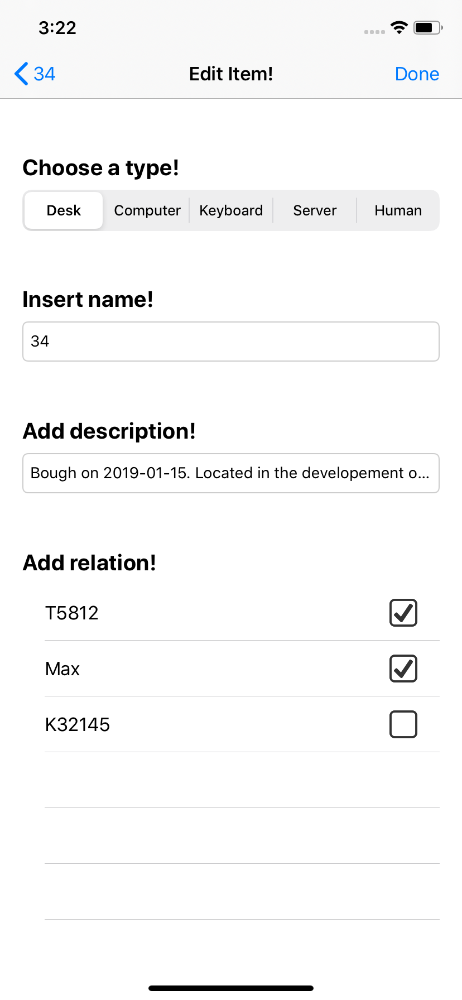

# Object Management

The goal is to create a system for managing objects. For example, an object can be a desk, computer, keyboard, server or human being.

Objects have the following attributes: name, descriptions and type.

The following functions are available:

* Create/edit/delete objects
* Create/edit/delete relations between objects (for example a desk can contain a keyboard and Max uses the desk as a workplace)
* Search for objects
* All data are serialisable/storable. (Using persistent storage with Realm)

The GUI has been implemented based on  Apple Human Interface Guidelines.

## Further informations:

An Objects management system iOS app written in Swift using Realm

The implementation done in **Swift - iOS13**

**IQKeyboardManager** used to prevent this issue of keyboard sliding up and covering UITextField/UITextView without needing to write any code or make any additional setup.

**SwipeCellKit** which is an open source tool. It is used for creating a swipeable UItable view cell app with animation. Swipecell kit is based on email app with support for different transition effects as user swipes and destructive swiping.
The swipeable UItable view support for
1. Left and right swipe actions.
2. Action buttons.
3. Customizable transitions.
4. Animated expansions.

**Realm** which is an open source object database management system, initially for mobile, also available for platforms such as Xamarin or React Native, and others, including desktop applications, and is licensed under the Apache License.

## Features

**SearchBar** used to search Items by their names

**Button checkboxes** to add/remove relations between Items

**Realm** for storing data locally

**SwipeCellKit** for swiping left to delete Item

**IQKeyboardManager** to avoid issues when the keyboard shows up

## Architecture
* Persistent and simple datastore with Realm
* Swipeable table cells with SwipeCellKit
* IQKeyboardManager for preventing issues related to keyboard sliding. 

## MVC
The Model-View-Controller (MVC) design pattern assigns objects in an application one of three roles: model, view, or controller. The pattern defines not only the roles objects play in the application, it defines the way objects communicate with each other. Each of the three types of objects is separated from the others by abstract boundaries and communicates with objects of the other types across those boundaries. The collection of objects of a certain MVC type in an application is sometimes referred to as a layer—for example, model layer.

## Installation
Clone

Run pod install

Build

## Screenshots

   
